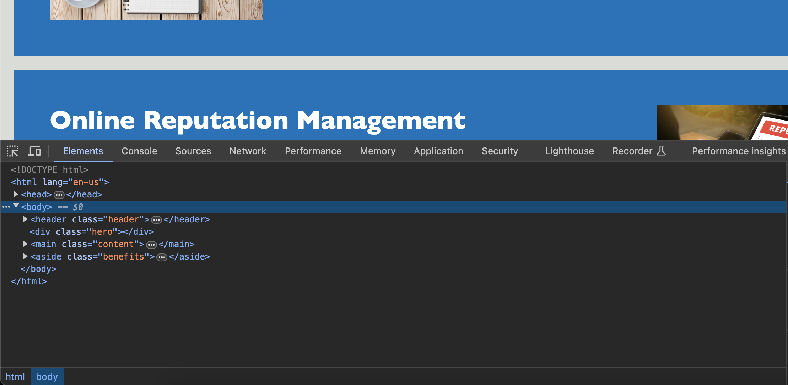

# CODE_REFACTOR

## Description

Web accessibility code refactor in order to add modern HTML syntax to outdated "div" approach, for a well organized structure, code readability and design experience without altering the code's external behavior.

## Example

 ## Links

For access to deployed website -- <a href=“https://parryprogramming.github.io/code_refactor/”>Click Here</a>.
